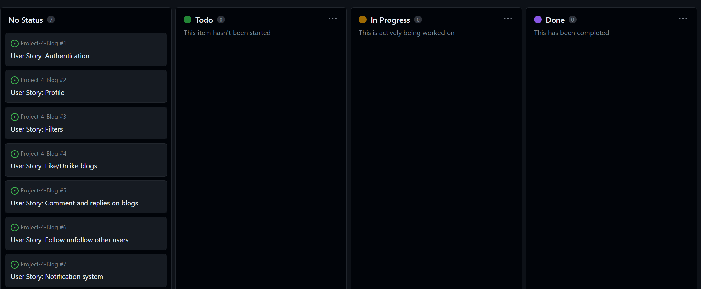
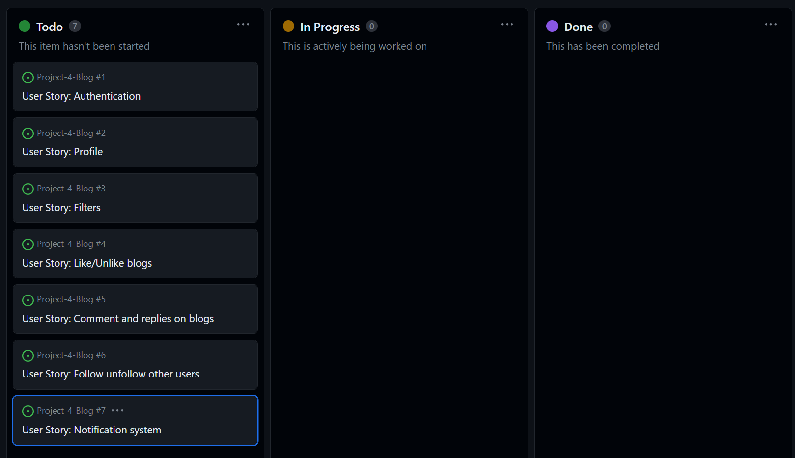
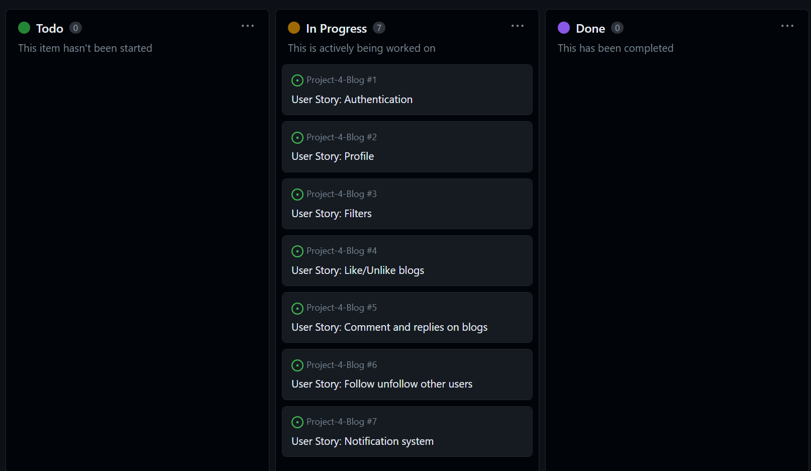
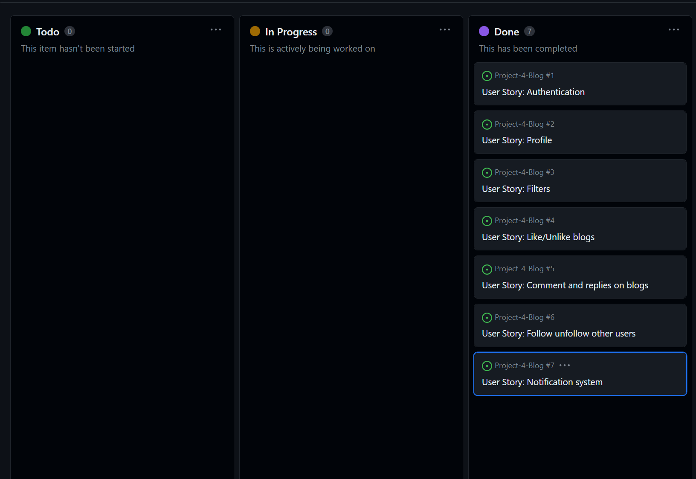
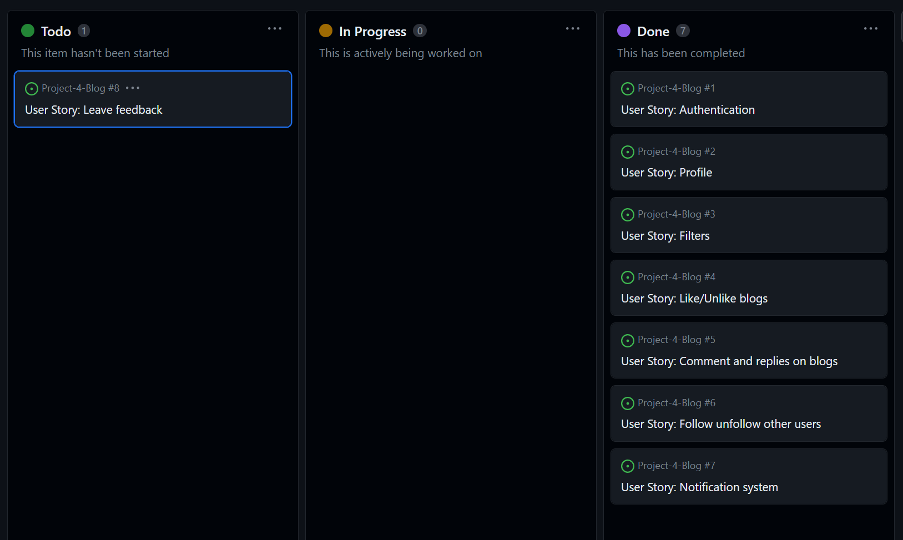
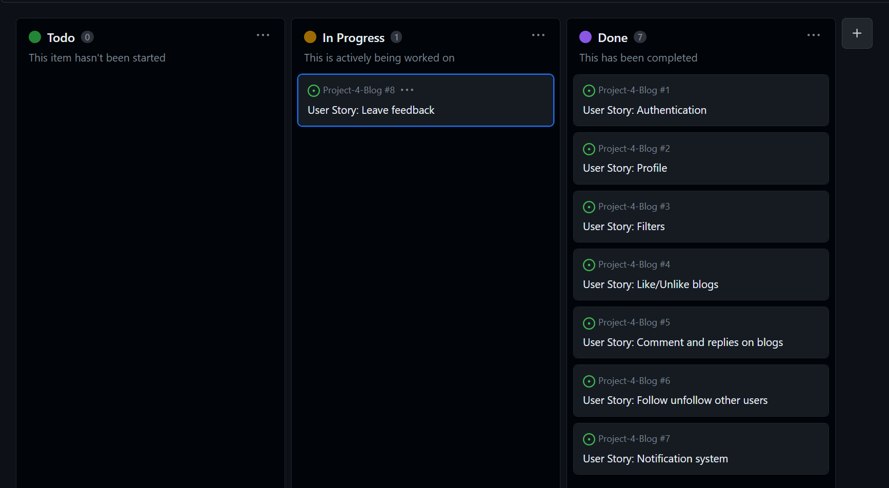
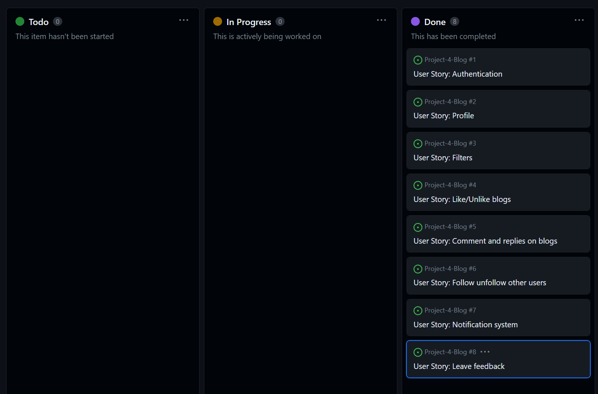
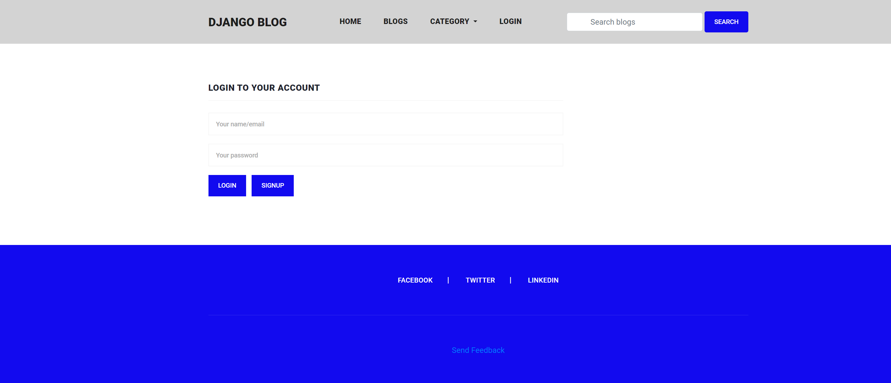

# Project-4 Django Blog Website

This Blog Website Django app is a powerful web application designed to facilitate the creation, management, and sharing of blog posts. With a comprehensive set of features, the app offers a complete solution for bloggers, content creators, and website owners.
Overall, the Blog Website app provides a powerful and comprehensive solution for anyone looking to create, manage, and share their blog content in a secure and flexible manner.

Click here to view website: [Blog](https://project-4-blog.herokuapp.com/)

# UXD - User Experience Design

Epic 1: Blog Management
As a user, I want to be able to perform CRUD operations on blogs so that I can create, read, update and delete my own blogs or blogs of other users.

User Stories
As a user, I want to be able to create a new blog post so that I can share my ideas with others.
As a user, I want to be able to edit my existing blog post so that I can make changes to my post whenever I want.
As a user, I want to be able to delete my own blog post so that I can remove any unwanted posts from my profile.
As a user, I want to be able to view other users' blog posts so that I can read and learn from them.
As a user, I want to be able to filter the blogs by different criteria such as title, category, and tags so that I can easily find the blogs of my interest.

Epic 2: User Management
As a user, I want to be able to manage my personal profile and interact with other users in the platform.

User Stories
As a user, I want to be able to register on the platform using my email and password so that I can create an account and use the platform.
As a user, I want to be able to update my profile information such as name, profile picture.
As a user, I want to be able to search for other users on the platform so that I can connect with them.
As a user, I want to be able to follow/unfollow other users so that I can stay updated with their latest blog posts.
As a user, I want to be able to like and comment on other users' blog posts so that I can interact with them.
As a user, I want to be able to receive notifications for activities such as likes, comments, and follows so that I can stay informed.
As a user, I want to be able to mute/unmute notifications so that I can customize my notification settings according to my preferences.

Epic 3: Security and Authentication
As a user, I want my data to be secure and my account to be authenticated through multiple means.

User Stories
As a user, I want to be able to login using my email and password so that I can access my account.
As a user, I want my account to be authenticated through both username and email so that my account is more secure.
As a user, I want my password to be encrypted and my account information to be secure so that my data is safe from unauthorized access.

Epic 4: Blog Interaction
As a user, I want to be able to interact with other users' blog posts by commenting and replying to comments.

User Stories
As a user, I want to be able to comment on other users' blog posts so that I can express my thoughts and opinions.
As a user, I want to be able to reply to other users' comments so that I can continue the conversation and engage with the community.
As a user, I want to be able to like other users' comments so that I can express my agreement.
As a user, I want to be able to receive notifications for new comments and replies on my blog posts so that I can stay engaged with the community.

Epic 5: Advanced Search and Filtering
As a user, I want to be able to perform advanced searches and filtering on blogs based on various parameters.

User Stories
As a user, I want to be able to search for blogs based on advanced parameters such as author and keyword.

Epic 6: Feedback and Support
As a user, I want to be able to give feedback and receive support from the admin so that I can improve my experience on the platform.

User Stories
As a user, I want to be able to contact the admin through a support form so that I can report bugs or suggest improvements.
As a user, I want to be able to receive timely and helpful responses from the admin so that my issues can be resolved quickly.
As an admin, I want to be able to track user feedback and support requests so that I can improve the platform based on user needs.
As an admin, I want to be able to respond to user feedback and support requests in a timely and professional manner so that users feel heard and valued.

## Agile Methodology
This application was developed using agile methodology. 

# Features

### Navigation Bar
The navigation bar is fixed at the top of every page and includes links to other pages.
The link for the current page is shown in blue to visually indicate which page the user is on.

### Footer
The footer includes links to Facebook, Twitter and LinkedIn. 

### Sign Up Page

Sign Up page is accessed from the Login page on the sign up button. 
Users can enter their details here to register and log in. 

### Log In Page

Log In page is accessed from the Log In link on the navigation bar, which is available to users who are not logged in already.
Returning users can enter their details here to log in to avail of all the features.

### Home Page

The home page has contains the nav bar with all relevant links(Home, Blogs, Category, User).

Project Summary and Features
================

  + Crud operation on blogs
  + Custom user model
  + Registration
  + Authentication through username plus email
  + Personal profile management
  + Filter blogs by different criteria (title, category, tags)
  + Search blogs by different criteria
  + Like blogs
  + Comment and replies on blogs
  + Follow unfollow other users
  + Notification system
  + Mute unmute notifications

