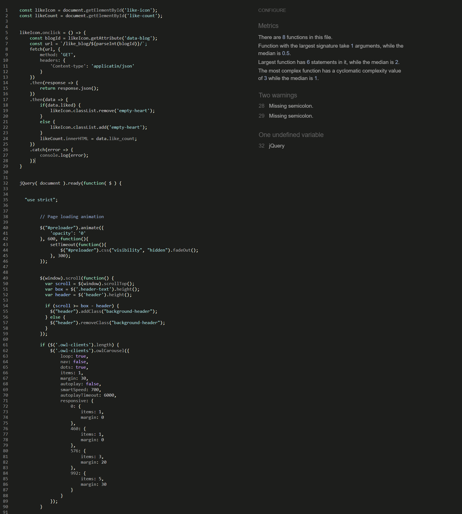

# Project-4 Django Blog Website

This Blog Website Django app is a powerful web application designed to facilitate the creation, management, and sharing of blog posts. With a comprehensive set of features, the app offers a complete solution for bloggers, content creators, and website owners.
Overall, the Blog Website app provides a powerful and comprehensive solution for anyone looking to create, manage, and share their blog content in a secure and flexible manner.

Project Summary and Features
================

  + Crud operation on blogs
  + Custom user model
  + Registration
  + Authentication through username plus email
  + Personal profile management
  + Filter blogs by different criteria (title, category, tags)
  + Search blogs by different criteria
  + Like blogs
  + Comment and replies on blogs
  + Follow unfollow other users
  + Notification system
  + Mute unmute notifications

Click here to view website: [Blog](https://project-4-blog.herokuapp.com/)

# UXD - User Experience Design

Epic 1: Blog Management
As a user, I want to be able to perform CRUD operations on blogs so that I can create, read, update and delete my own blogs or blogs of other users.

User Stories
As a user, I want to be able to create a new blog post so that I can share my ideas with others.
As a user, I want to be able to edit my existing blog post so that I can make changes to my post whenever I want.
As a user, I want to be able to delete my own blog post so that I can remove any unwanted posts from my profile.
As a user, I want to be able to view other users' blog posts so that I can read and learn from them.
As a user, I want to be able to filter the blogs by different criteria such as title, category, and tags so that I can easily find the blogs of my interest.

Epic 2: User Management
As a user, I want to be able to manage my personal profile and interact with other users in the platform.

User Stories
As a user, I want to be able to register on the platform using my email and password so that I can create an account and use the platform.
As a user, I want to be able to update my profile information such as name, profile picture.
As a user, I want to be able to search for other users on the platform so that I can connect with them.
As a user, I want to be able to follow/unfollow other users so that I can stay updated with their latest blog posts.
As a user, I want to be able to like and comment on other users' blog posts so that I can interact with them.
As a user, I want to be able to receive notifications for activities such as likes, comments, and follows so that I can stay informed.
As a user, I want to be able to mute/unmute notifications so that I can customize my notification settings according to my preferences.

Epic 3: Security and Authentication
As a user, I want my data to be secure and my account to be authenticated through multiple means.

User Stories
As a user, I want to be able to login using my email and password so that I can access my account.
As a user, I want my account to be authenticated through both username and email so that my account is more secure.
As a user, I want my password to be encrypted and my account information to be secure so that my data is safe from unauthorized access.

Epic 4: Blog Interaction
As a user, I want to be able to interact with other users' blog posts by commenting and replying to comments.

User Stories
As a user, I want to be able to comment on other users' blog posts so that I can express my thoughts and opinions.
As a user, I want to be able to reply to other users' comments so that I can continue the conversation and engage with the community.
As a user, I want to be able to like other users' comments so that I can express my agreement.
As a user, I want to be able to receive notifications for new comments and replies on my blog posts so that I can stay engaged with the community.

Epic 5: Advanced Search and Filtering
As a user, I want to be able to perform advanced searches and filtering on blogs based on various parameters.

User Stories
As a user, I want to be able to search for blogs based on advanced parameters such as author and keyword.

Epic 6: Feedback and Support
As a user, I want to be able to give feedback and receive support from the admin so that I can improve my experience on the platform.

User Stories
As a user, I want to be able to contact the admin through a support form so that I can report bugs or suggest improvements.
As a user, I want to be able to receive timely and helpful responses from the admin so that my issues can be resolved quickly.
As an admin, I want to be able to track user feedback and support requests so that I can improve the platform based on user needs.
As an admin, I want to be able to respond to user feedback and support requests in a timely and professional manner so that users feel heard and valued.

## Agile Methodology
This application was developed using agile methodology. 

# Design

The color paletteI chose is blue and white. It is a popular combination that can evoke a sense of calmness, professionalism, and simplicity.
White is a neutral color that can help create a clean and modern look for a website. It also provides a blank canvas that can be complemented with other colors to add emphasis or contrast.
Blue, on the other hand, is often associated with trust, stability, and intelligence. It can convey a sense of security, which makes it a popular choice for corporate and financial websites. Blue can also be used to create a sense of depth and serenity, making it a popular choice for websites related to wellness, health, or technology.
When used together, blue and white can create a sophisticated and elegant aesthetic that can be easily associated with professionalism and quality. The combination is a classic choice for businesses, organizations, and individuals looking for a timeless and reliable look for their website.

# Features

### Navigation Bar
The navigation bar is fixed at the top of every page and includes links to other pages and a search box(searching posts).
The link for the current page is shown in blue to visually indicate which page the user is on.

### Home Page

The home page has contains the nav bar with all relevant links(Home, Blogs, Category, User) and the footer containing links(not real links) to the social media websites(Facebook, Twitter, Linkedin) and a Send Feedback link.

### Blogs Page

This Page shows the latest blog posts.

### Sign Up Page

Sign Up page is accessed from the Login page on the sign up button. 
Users can enter their details here to register and log in. 

### Log In Page

Log In page is accessed from the Log In link on the navigation bar, which is available to users who are not logged in already.
Returning users can enter their details here to log in to avail of all the features.

### Category

The category button is a dropdown menu which can be used as a filter by category

### User(User name after loggin in)

The user button appears when you are loggedin and it is a dropdown menu which includes: "My profile", "Notifications" and "Logout" options.

My Profile: The users can edit their details from here:

Using the My blogs page, users can view, edit and delete their posts.

### Notifications

From the notifications page you can view notifications regarding your posts(i.e another user liked your post or started to follow you.)

### Footer
The footer includes links to Facebook, Twitter and LinkedIn. 

### Follow/Unfollow and Mute/Unmute notifications
You can as well follo/unfollow other users and mute/unmute notifications:

### Comment and like on other users posts
There is a functinality built, which allows other user to comment and like your posts:

# Technologies Used

## Languages
* [HTML](https://html.spec.whatwg.org/) was used to create the content and structure for the application.
* [CSS](https://www.w3.org/Style/CSS/Overview.en.html) was used to add styling to the application.
* [Python](https://www.python.org/) was used to add functionality to the application.
* [JavaScript](https://en.wikipedia.org/wiki/JavaScript) was used to create interactive content for the application.

## Frameworks, Libraries and Tools Used within the Application
* [Django](https://www.djangoproject.com/) was used as the main Python framework for the application.
* [ElephantSQL](https://www.elephantsql.com/) was used for the Production database.
* [Cloudinary](https://cloudinary.com/) was used initialy to store all static files and images. I had quite a challanging time with this as it wasn't reading all my CSS,not able to show "fontawesome" icons and some characters in the Description table(they all work perfectly on local), therefore I took the decision to use instead [Withenoise](https://whitenoise.readthedocs.io/en/latest/), only to realize later that you can't upload images on whitenoise, so what I did next was to use both Cloudianry (to store the images) and Whitenoise (to store the rest of the static files).
* [Git](https://git-scm.com/) was used for version control and tracked changes in the codes.
* [GitHub](https://github.com/) was used to store the repository and the codes.
* [Gitpod](https://www.gitpod.io/) was used to create, edit and preview the codes during the development.
* [Heroku](https://id.heroku.com/login) was used to deploy the application.

## Testing
* Lighthouse for performance check:

* [W3C HTML Validator](https://validator.w3.org/) was used to validate HTML codes.

* [W3C CSS Validator](https://jigsaw.w3.org/css-validator/) was used to validate CSS codes.

* [JSHint](https://jshint.com/) was used to validate JavaScript codes.

Due to time constraint, I wasn't able to clear all error (this time was a little bit more time consuming than on previous projects, due to the complexity of this project), but will definetlly clear all of them in the near future.

### Deployment - Heroku
The following are the steps to deploy the application on Heroku.

1. Create a repository in GitHub using [Code Institute template](https://github.com/Code-Institute-Org/gitpod-full-template)
2. Open GitPod from the newly created repository
3. Install Django and supporting libraries:
4. Create requirements.txt
5. Create a Django project
6. Create an app
7. Add the newly created app into settings.py
8. Migrate the Changes
9. Run the server to verify that the basic skelton project is now up and running
10. Create an app in [Heroku](https://dashboard.heroku.com/login)
11. Create a database in [ElphantSQL](https://www.elephantsql.com/)
12. Create an env.py
13. Add SQLite database to .gitignore file
14. Modify settings.py file
15. Migrate Database Structure to the ElephantSQL database
16. Push the Changes to GitHub
17. Set Up Cloudinary and Whitenoise
18. Set up Heroku Config Vars
19. Update settings.py
20. Create Static Files
21. Create Procfile
22. Push the Changes to GitHub
23. Deploy the app in Heroku

 ## Credits
 This tutorial helped me put the base of my Django project, it's a great tutorial explaining step by step how to build a project like this [Django Tutorial](https://www.youtube.com/watch?v=WpyXXBTcERc&list=PLFIUQuoVboS-nnEsyVYuwS0S1-tQJRwc8&index=8&t=13s&ab_channel=NabilMoiun)

 I used [this repository](https://github.com/mikyrenato/happy-beans) to inspire myself when creating the readme file.

 I also used the following online resources:

- [Code Institute](https://codeinstitute.net/ie/)
- [Slack](https://slack.com/intl/en-ie/) 
- [Stack OverFlow](https://stackoverflow.com)
- [YouTube](https://www.youtube.com/)
- [W3Schools.com](https://www.w3schools.com/)
- [Chat GPT](https://chat.openai.com/)

 

----
 ## Acknowledgements

 Many thanks to my mentor Harry Dhillon for his guidance and support and to my friend Marcin Placek for helping me with the testing of the website.
